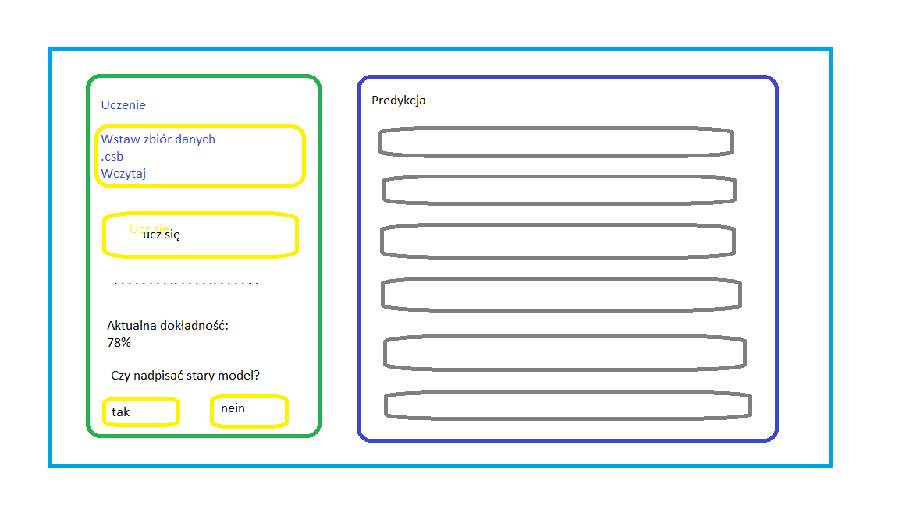

# System ekspertowy dla banku
System predyktuje, czy dany klient banku kwalifikuje się do otrzymania pożyczki/kredytu.  
Zbiór danych: https://www.kaggle.com/datasets/janiobachmann/bank-marketing-dataset

Aplikacja webowa podzielona na 3 sekcje:
0. Uwierzytelnianie - formularz z rejestracją i logowaniem
1. Uczenie (dostępne jeśli zalogowano się na admina) (scenariusz pozytywny - nadpisanie starego modelu)
    - admin konfiguruje parametru algorytmu i uruchamia uczenie (button "Ucz się") 
    - admin widzi indykator ładowania, w tym czasie na serwerze w kodzie backendowym uczony jest model
    - admin otrzymuje informacje z powodzeniem operacji, wyświetlana jest aktualna dokładność oraz komunikat "czy nadpisać stary model?"
    - admin wybiera nadpisanie modelu, po czym na serwer wysyłana jest informacja, że stary model ma zostać nadpisany
2. Predykcja (scenariusz pozytywny)
    - użytkownik wypełnia formularz (textboxy, slidery i inne zabawki)
    - użytkownik klika button "Zatwierdź", po czym dane o próbce są wysyłane na serwer
    - użytkownik widzi indykator ładowania, w tym czasie na serwerze predyktowany jest wynik
    - wyświetlona zostaje informacja z predykcją/klasyfikacją dla danej próbki
    
Scenariusz negatywny to wyświetlenie błędu (złe dane, błąd serwera, itp.), wtedy wyświetlane jest okienko z kodem błędu i informacją. 

